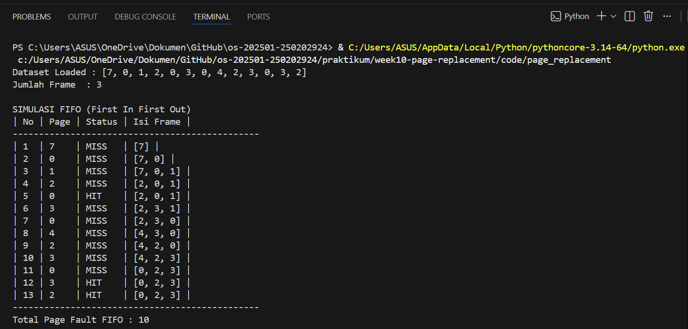
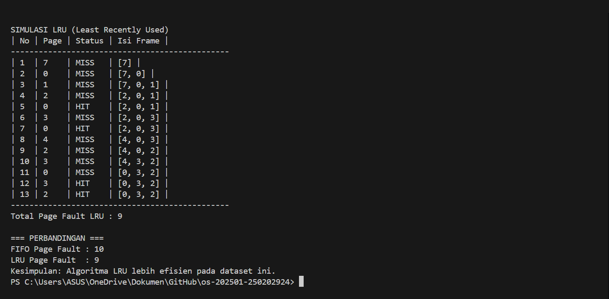

# Laporan Praktikum Minggu [10]
Topik: Manajemen Memori – Page Replacement (FIFO & LRU)

---

## Identitas
- **Nama**  : Putri Amaliya Rahmadani  
- **NIM**   : 250202924  
- **Kelas** : 1 IKRA

---

## Tujuan
Setelah menyelesaikan tugas ini, mahasiswa mampu:
1. Mengimplementasikan algoritma page replacement FIFO dalam program.
2. Mengimplementasikan algoritma page replacement LRU dalam program.
3. Menjalankan simulasi page replacement dengan dataset tertentu.
4. Membandingkan performa FIFO dan LRU berdasarkan jumlah page fault.
5. Menyajikan hasil simulasi dalam laporan yang sistematis.
---

## Dasar Teori
1. Memori virtual adalah cara sistem operasi mengatur memori agar program tetap bisa berjalan walaupun memori utama terbatas.
2. Page replacement terjadi saat halaman yang dibutuhkan tidak ada di memori, sehingga sistem harus mengganti halaman lain.
3. FIFO (First In First Out) mengganti halaman yang pertama kali masuk ke memori.
4. LRU (Least Recently Used) mengganti halaman yang paling lama tidak digunakan.
5. Perbedaan cara kerja FIFO dan LRU menyebabkan jumlah page fault yang dihasilkan bisa berbeda
---

## Langkah Praktikum
1. Membuat folder praktikum/week10-page-replacement/ dengan subfolder code dan screenshots.
2. Membuat file reference_string.txt yang berisi data uji:
 ```
   7, 0, 1, 2, 0, 3, 0, 4, 2, 3, 0, 3, 2
 ```
serta menetapkan jumlah frame sebanyak 3 frame.
3. Membuat program Python `page_replacement.py` untuk:
- Membaca dataset dari file
- Mensimulasikan algoritma FIFO dan LRU
4. Menjalankan program melalui terminal dan mencatat setiap page hit dan page fault.
5. Mendokumentasikan hasil simulasi, perhitungan page fault, dan analisis perbandingan pada file `laporan.md`.
6. Commit & Push
  ```
  git add .
  git commit -m "Minggu 10 - Page Replacement FIFO & LRU"
  git push origin main
  ``` 

---

## Kode / Perintah
```
pages = [7,0,1,2,0,3,0,4,2,3,0,3,2]
frame_size = 3

def fifo(pages):
    frame, idx, fault = [], 0, 0
    print("\nSIMULASI FIFO (First In First Out)")
    print("| No | Page | Status | Isi Frame |")
    print("-"*47)

    for i,p in enumerate(pages):
        if p in frame:
            status = "HIT"
        else:
            status = "MISS"
            fault += 1
            if len(frame) < frame_size:
                frame.append(p)
            else:
                frame[idx] = p
                idx = (idx+1) % frame_size
        print(f"| {i+1:<2} | {p:<4} | {status:<6} | {frame} |")

    print("-"*47)
    print("Total Page Fault FIFO :", fault)
    return fault


def lru(pages):
    frame, recent, fault = [], [], 0
    print("\nSIMULASI LRU (Least Recently Used)")
    print("| No | Page | Status | Isi Frame |")
    print("-"*47)

    for i,p in enumerate(pages):
        if p in frame:
            status = "HIT"
            recent.remove(p)
        else:
            status = "MISS"
            fault += 1
            if len(frame) < frame_size:
                frame.append(p)
            else:
                old = recent.pop(0)
                frame[frame.index(old)] = p
        recent.append(p)
        print(f"| {i+1:<2} | {p:<4} | {status:<6} | {frame} |")

    print("-"*47)
    print("Total Page Fault LRU :", fault)
    return fault


print("Dataset Loaded :", pages)
print("Jumlah Frame  :", frame_size)

f_fifo = fifo(pages)
f_lru  = lru(pages)

print("\n=== PERBANDINGAN ===")
print("FIFO Page Fault :", f_fifo)
print("LRU Page Fault  :", f_lru)
print("Kesimpulan: Algoritma LRU lebih efisien pada dataset ini.")

```

---

## Hasil Eksekusi
Sertakan screenshot hasil percobaan atau diagram:



---

## Analisis
1. **Perbandingan Algoritma FIFO dan LRU**
   
   Untuk mengetahui perbedaan kinerja algoritma FIFO dan LRU, dilakukan perbandingan berdasarkan jumlah page fault yang
   dihasilkan dari proses simulasi. Hasil perbandingan tersebut disajikan dalam bentuk tabel sebagai berikut:

   **Tabel Perbandingan Algoritma**
   
    | Algoritma | Jumlah Page Fault | Keterangan |
    | --------- | ----------------- | ------------------------ |
    | FIF0 | 10 | Mengganti halaman berdasarkan urutan pertama masuk ke memori. |
    | LRU | 9 | Mengganti halaman yang sudah lama tidak digunakan. |


3. **Analisis Perbedaan Page Fault**

    Berdasarkan hasil simulasi yang dilakukan, algoritma FIFO menghasilkan jumlah page fault yang lebih banyak dibandingkan  
    dengan algoritma LRU. Hal ini terjadi karena FIFO tidak memperhatikan apakah halaman masih sering digunakan atau tidak,  
    melainkan hanya berdasarkan urutan masuk ke memori.
    Sementara itu, algoritma LRU mempertahankan halaman yang baru saja diakses. Dengan cara tersebut, halaman yang sering
    digunakan memiliki kemungkinan lebih kecil untuk diganti sehingga jumlah page fault menjadi lebih sedikit.

3. **Analisis Efisiensi Algoritma**

   Dari hasil praktikum ini dapat disimpulkan bahwa algoritma LRU lebih baik digunakan dibandingkan FIFO pada dataset yang      diuji. Hal ini karena LRU menyesuaikan penggantian halaman dengan pola penggunaan data.
   Sebaliknya, FIFO dapat mengganti halaman yang masih dibutuhkan hanya karena halaman tersebut masuk lebih awal ke memori,     sehingga menghasilkan page fault yang lebih banyak.

   
---

## Kesimpulan
- Praktikum ini membantu memahami cara kerja memori virtual, khususnya proses page replacement ketika terjadi page fault.
- Dari hasil simulasi, algoritma FIFO dan LRU memiliki cara kerja yang berbeda dalam mengganti halaman, sehingga
  menghasilkan jumlah page fault yang berbeda.
- Berdasarkan dataset yang digunakan, algoritma LRU menghasilkan page fault lebih sedikit dibandingkan FIFO, sehingga lebih
  efektif dalam penggunaan memori.

---

## Quiz
1. **Apa perbedaan utama FIFO dan LRU?**
   
   **Jawab:**

   Perbedaan algoritma FIFO dan LRU adalah algoritma FIFO mengganti halaman yang pertama kali masuk ke memori berdasarkan
   urutan kedatangannya tanpa melihat frekuensi pemakaian, sedangkan algoritma LRU mengganti halaman yang sudah lama tidak
   digunakan dengan melihat riwayat akses halaman.

2. **Mengapa FIFO dapat menghasilkan Belady’s Anomaly?**

   **Jawab:**

   FIFO dapat mengalami Belady’s Anomaly karena algoritma ini mengganti halaman berdasarkan urutan kedatangan tanpa  
   memperhatikan pola penggunaan halaman, sehingga penambahan jumlah frame tidak selalu mengurangi jumlah page fault.

3. **Mengapa LRU umumnya menghasilkan performa lebih baik dibanding FIFO?**

   **Jawab:**

   Algoritma LRU umumnya menghasilkan performa yang lebih baik dibandingkan FIFO karena LRU mengganti halaman yang sudah  
   lama tidak digunakan, sedangkan FIFO hanya mengganti halaman berdasarkan urutan masuk ke memori tanpa melihat pola  
   penggunaan.
      

---

## Refleksi Diri
Tuliskan secara singkat:
- Apa bagian yang paling menantang minggu ini? mengikuti langkah simulasi FIFO dan LRU karena harus teliti melihat perubahan isi frame. 
- Bagaimana cara Anda mengatasinya? mencari tutorial atau sumber belajar tambahan. 

---

**Credit:**  
_Template laporan praktikum Sistem Operasi (SO-202501) – Universitas Putra Bangsa_
