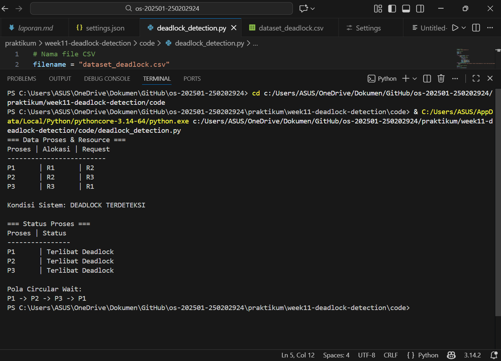

# Laporan Praktikum Minggu 11
Topik: Simulasi dan Deteksi Deadlock
---

## Identitas
- **Nama**  : Putri Amaliya Rahmadani  
- **NIM**   : 250202924 
- **Kelas** : 1 IKRA
---

## Tujuan
Setelah menyelesaikan tugas ini, mahasiswa mampu:

1. Membuat program sederhana untuk mendeteksi deadlock.
2. Menjalankan simulasi deteksi deadlock dengan dataset uji.
3. Menyajikan hasil analisis deadlock dalam bentuk tabel.
4. Memberikan interpretasi hasil uji secara logis dan sistematis.
5. Menyusun laporan praktikum sesuai format yang ditentukan.


---

## Dasar Teori
1. Deadlock adalah kondisi di mana beberapa proses berhenti karena masing-masing menunggu resource yang sedang dipakai proses lain.
2. Deadlock terjadi karena empat syarat terpenuhi: resource eksklusif, proses pegang resource sambil minta resource lain, resource tidak bisa diambil paksa, dan adanya siklus saling menunggu.
3. Contohnya, P1 pegang R1 minta R2, P2 pegang R2 minta R3, P3 pegang R3 minta R1 → semua proses stuck dan deadlock terjadi.

---

## Langkah Praktikum
1. Struktur folder (sesuaikan dengan template repo):
```
praktikum/week11-deadlock-detection/
├─ code/
│  ├─ deadlock_detection.*
│  └─ dataset_deadlock.csv
├─ screenshots/
│  └─ hasil_deteksi.png
└─ laporan.md
```
2. Menyiapkan Dataset

Gunakan dataset sederhana yang berisi:
- Daftar proses
- Resource Allocation
- Resource Request / Need

Contoh tabel:

| Proses |	Allocation |	Request |
|--------|-------------|----------|
| P1 |	R1 |	R2 |
| P2 |	R2 |	R3 |
| P3 |	R3 |	R1 |


3. Implementasi Algoritma Deteksi Deadlock

Program minimal harus:
- Membaca data proses dan resource.
- Menentukan apakah sistem berada dalam kondisi deadlock.
- Menampilkan proses mana saja yang terlibat deadlock.

4. Eksekusi & Validasi

- Jalankan program dengan dataset uji.
- Validasi hasil deteksi dengan analisis manual/logis.
- Simpan hasil eksekusi dalam bentuk screenshot.

5. Analisis Hasil

- Sajikan hasil deteksi dalam tabel (proses deadlock / tidak).
- Jelaskan mengapa deadlock terjadi atau tidak terjadi.
- Kaitkan hasil dengan teori deadlock (empat kondisi).

6. Commit & Push

```bash
git add .
git commit -m "Minggu 11 - Deadlock Detection"
git push origin main
```


---

## Kode / Perintah


---

## Hasil Eksekusi
Sertakan screenshot hasil percobaan atau diagram:


---

## Analisis
**Tabel Hasil Deteksi**

| Proses | Resource Dialokasikan | Resource Diminta | Status   |
| ------ | --------------------- | ---------------- | -------- |
| P1 | R1 | R2 | Deadlock |
| P2 | R2 | R3 | Deadlock |
| P3 | R3 | R1 | Deadlock |

Semua proses berada dalam status deadlock. Deadlock terjadi karena setiap proses menunggu resource yang sedang dipegang oleh proses lain, sehingga tidak ada proses yang bisa melanjutkan eksekusi.

**Penjelasan**

- P1 memegang R1 dan menunggu R2 yang sedang digunakan oleh P2.
- P2 memegang R2 dan menunggu R3 yang sedang digunakan oleh P3.
- P3 memegang R3 dan menunggu R1 yang sedang digunakan oleh P1.

Kondisi ini membentuk siklus circular wait, sehingga seluruh proses mengalami kebuntuan permanen (deadlock).

**Kaitannya dengan Teori Deadlock**

Menurut teori sistem operasi, deadlock terjadi jika empat kondisi Coffman terpenuhi sekaligus. Pada kasus ini:

- Mutual Exclusion → Resource hanya bisa dipakai oleh satu proses pada satu waktu. Terpenuhi, karena R1, R2, dan R3 eksklusif.
- Hold and Wait → Proses memegang resource sambil menunggu resource lain. Terpenuhi, karena setiap proses memegang satu resource sambil menunggu resource berikutnya.
- No Preemption → Resource tidak bisa direbut paksa. Terpenuhi, karena resource dilepas hanya setelah proses selesai.
- Circular Wait → Ada siklus saling menunggu antar proses. Terpenuhi, karena P1 → P2 → P3 → P1.

Karena keempat kondisi terjadi bersamaan, tidak ada proses yang bisa berjalan, sehingga sistem mengalami deadlock. Program deteksi deadlock berhasil menunjukkan proses mana saja yang terlibat.

**Solusi Pencegahan Deadlock**
Deadlock bisa dicegah dengan menghilangkan salah satu dari empat kondisi:

- Menggunakan resource ordering untuk mencegah circular wait, misalnya semua resource diakses dalam urutan tertentu.
- Menggunakan algoritma penghindaran deadlock seperti Banker's Algorithm.
- Pendekatan deteksi dan pemulihan: menghentikan salah satu proses yang terlibat deadlock agar sistem bisa berjalan kembali.


---

## Kesimpulan
Sistem mengalami deadlock karena semua proses saling nunggu resource yang lagi dipakai proses lain, jadi gak ada yang bisa jalan. Deadlock ini terjadi karena keempat syarat Coffman terpenuhi: mutual exclusion, hold and wait, no preemption, dan circular wait. Untuk mencegahnya, bisa pakai urutan resource, algoritma Banker, atau hentikan salah satu proses supaya sistem bisa jalan lagi.

---

## Quiz
1. Apa perbedaan antara deadlock prevention, avoidance, dan detection?

    **Jawab:**
 
  - Prevention → Mencegah deadlock sebelum terjadi dengan cara membatasi cara proses pakai resource.
  - Avoidance → Menghindari deadlock saat proses jalan dengan memeriksa apakah permintaan resource aman.
  - Detection → Mendeteksi deadlock setelah terjadi dan mengambil tindakan untuk memulihkan sistem.
2. Mengapa deteksi deadlock tetap diperlukan dalam sistem operasi?
  
   **Jawab:**

   Deteksi deadlock tetap penting karena tidak semua sistem bisa mencegah atau menghindari deadlock dengan sempurna sehingga    sistem harus punya cara untuk mengetahui kapan deadlock terjadi dan memperbaikinya supaya proses tetap bisa jalan normal.    Menurut buku sistem operasi, metode deteksi deadlock diperlukan pada sistem yang mengizinkan deadlock  terjadi tetapi        harus segera diperbaiki dengan cara memeriksa apakah terjadi deadlock dan menentukan proses serta  resource yang terlibat    supaya bisa dilakukan pemulihan.
    
3. Apa kelebihan dan kekurangan pendekatan deteksi deadlock?

   **Jawab:**

   Pendekatan deteksi deadlock punya kelebihan karena bisa mengetahui dan mengatasi deadlock yang sudah terjadi sehingga 
   sistem tetap stabil dan resource tidak terbuang sia‑sia, tetapi juga punya kekurangan karena memerlukan pemeriksaan          berkala yang bisa memperlambat sistem dan menambah beban komputasi.
   
---

## Refleksi Diri
Tuliskan secara singkat:
- Apa bagian yang paling menantang minggu ini?saat membaca file CSV di Python karena sering muncul error  atau outputnya kosong.  
- Bagaimana cara Anda mengatasinya?memastikan file CSV ada di folder yang sama dengan script.  

---

**Credit:**  
_Template laporan praktikum Sistem Operasi (SO-202501) – Universitas Putra Bangsa_
