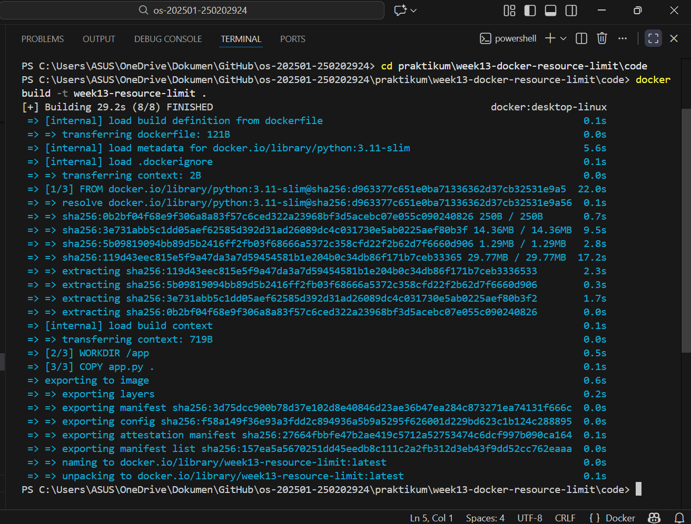
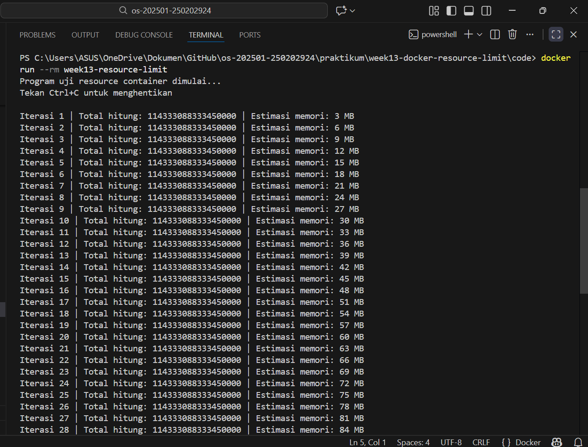
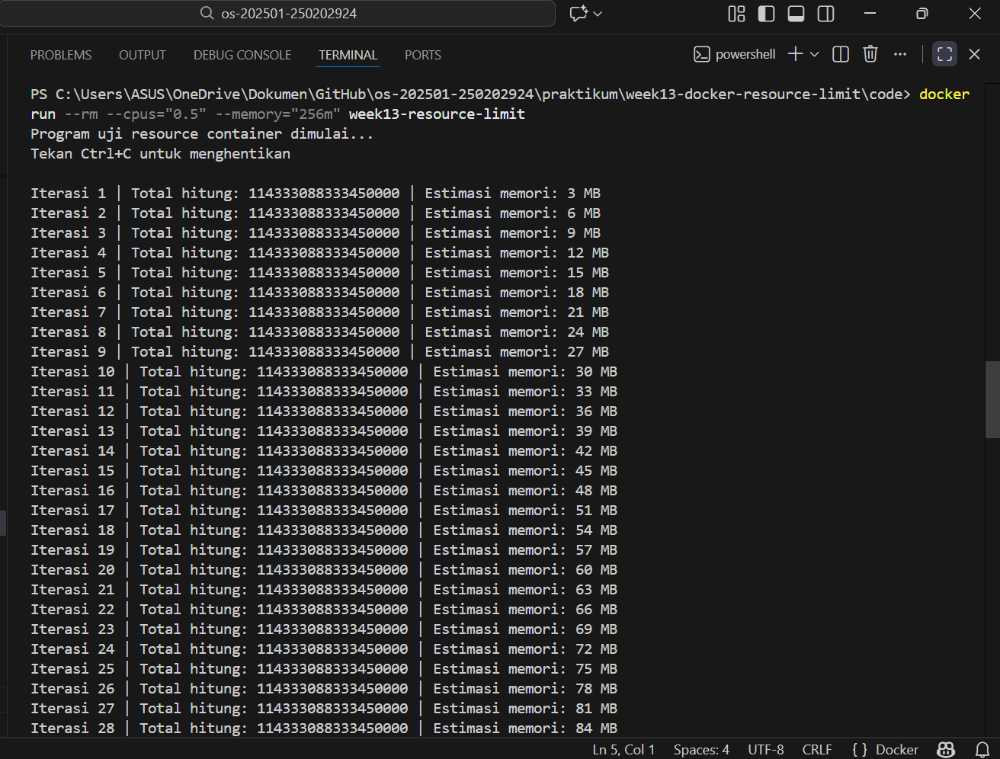

# Laporan Praktikum Minggu 13
Topik: Docker – Resource Limit (CPU & Memori)
---

## Identitas
- **Nama**  : Putri Amaliya Rahmadani
- **NIM**   : 250202924 
- **Kelas** : 1 IKRA

---

## Tujuan
Setelah menyelesaikan tugas ini, mahasiswa mampu:
1. Menulis Dockerfile sederhana untuk sebuah aplikasi/skrip.
2. Membangun image dan menjalankan container.
3. Menjalankan container dengan pembatasan **CPU** dan **memori**.
4. Mengamati dan menjelaskan perbedaan eksekusi container dengan dan tanpa limit resource.
5. Menyusun laporan praktikum secara runtut dan sistematis.

---

## Dasar Teori
1. Docker dan Container
   Docker adalah platform yang digunakan untuk menjalankan aplikasi di dalam container. Container memungkinkan aplikasi         berjalan secara terisolasi dari sistem utama, namun tetap menggunakan kernel sistem operasi yang sama. Dengan container,     aplikasi menjadi lebih ringan dan mudah dipindahkan antar lingkungan sistem.
2. Docker Image dan Dockerfile
   Docker image merupakan paket yang berisi aplikasi beserta seluruh dependensinya. Image dibuat menggunakan Dockerfile,        yaitu file konfigurasi yang berisi instruksi untuk membangun image, seperti menentukan base image, menyalin file             aplikasi, dan menjalankan perintah tertentu.
3. Manajemen Resource pada Container
   Docker menyediakan fitur untuk mengatur penggunaan resource seperti CPU dan memori. Pengaturan ini bertujuan agar satu       container tidak menggunakan seluruh resource sistem, sehingga container lain atau sistem utama tetap dapat berjalan          dengan baik.
4. Pembatasan CPU pada Docker
   Pembatasan CPU pada Docker dilakukan untuk mengatur seberapa besar jatah pemrosesan yang dapat digunakan oleh container.     Dengan membatasi CPU, proses di dalam container akan berjalan lebih lambat dibandingkan tanpa batasan, karena waktu          eksekusi dibagi dengan proses lain di sistem.
5. Pembatasan Memori pada Docker
   Pembatasan memori digunakan untuk menentukan jumlah maksimum memori yang dapat digunakan oleh container. Jika penggunaan     memori melebihi batas yang ditentukan, container dapat dihentikan secara otomatis. Hal ini penting untuk mencegah            kehabisan memori pada sistem secara keseluruhan.

---

## Langkah Praktikum
1. Sesuaikan struktur folder seperti berikut:
   ```
   praktikum/week13-docker-resource-limit/
   ├─ code/
   │  ├─ Dockerfile
   │  └─ app.*
   ├─ screenshots/
   │  └─ hasil_limit.png
   └─ laporan.md
   ```
2. Siapkan Docker dan pastikan sudah berjalan:
   Verifikasi:
     ```bash
     docker version
     docker ps
     ```
3. Buat program sederhana di folder `code/` (bahasa bebas) yang:
   - Melakukan komputasi berulang (untuk mengamati limit CPU), dan/atau
   - Mengalokasikan memori bertahap (untuk mengamati limit memori).
4. Buat Dockerfile
   - Tulis `Dockerfile` untuk menjalankan program uji.
   - Build image:
     ```bash
     docker build -t week13-resource-limit .
     ```
5. Jalankan container normal:
     ```bash
     docker run --rm week13-resource-limit
     ```
   Catat output/hasil pengamatan.
6. Jalankan container dengan batasan resource (contoh):
   ```bash
   docker run --rm --cpus="0.5" --memory="256m" week13-resource-limit
   ```
   Catat perubahan perilaku program (mis. lebih lambat, error saat memori tidak cukup, dll.).
7. Commit & Push

   ```bash
   git add .
   git commit -m "Minggu 13 - Docker Resource Limit"
   git push origin main
   ```

---

## Kode / Perintah
Tuliskan potongan kode atau perintah utama:
```bash
uname -a
lsmod | head
dmesg | head
```

---

## Hasil Eksekusi & Analisis
- Build Image
  

- Hasil pengujian tanpa limit
  


 - Hasil pengamatan tanpa limit:
   - Container dapat berjalan tanpa hambatan.
   - Proses perhitungan berjalan cepat.
   - Penggunaan memori terus bertambah setiap iterasi.
   - Tidak terjadi error atau penghentian program.
 - Penjelasan:
   Karena tidak ada pembatasan CPU dan memori, container bebas menggunakan resource dari sistem. Hal ini membuat proses         berjalan lebih cepat dan penggunaan memori terus meningkat tanpa kendala.
  
- hasil pengujian menggunakan limit
  


 - Hasil pengamatan menggunakan limit:
   - Container tetap dapat dijalankan dengan batasan resource.
   - Proses perhitungan berjalan lebih lambat.
   - Penggunaan CPU dan memori dibatasi sesuai parameter.
   - Container berpotensi berhenti jika melebihi batas memori.
 - Penjelasan:
  Dengan adanya pembatasan CPU dan memori, container tidak dapat menggunakan resource secara bebas. Akibatnya, kecepatan       eksekusi menurun dan penggunaan memori harus tetap berada dalam batas yang ditentukan.

---


## Kesimpulan
Praktikum ini membuktikan bahwa Docker merupakan platform yang efektif untuk menjalankan aplikasi di dalam container yang terisolasi. Dengan menggunakan container, aplikasi dapat dijalankan secara konsisten tanpa bergantung pada konfigurasi sistem operasi yang digunakan.

Pembatasan resource CPU dan memori pada Docker container memberikan pengaruh terhadap kinerja aplikasi. Pembatasan CPU menyebabkan proses berjalan lebih lambat, sedangkan pembatasan memori membatasi jumlah memori yang dapat digunakan oleh aplikasi dan dapat mePenerapan resource limit pada Docker penting untuk mengontrol penggunaan resource sistem agar tidak digunakan secara berlebihan. Dengan adanya pembatasan ini, sistem dapat berjalan lebih stabil dan penggunaan resource dapat dibagi secara lebih adil antar container.nghentikan container jika melebihi batas.

Penerapan resource limit pada Docker penting untuk mengontrol penggunaan resource sistem agar tidak digunakan secara berlebihan. Dengan adanya pembatasan ini, sistem dapat berjalan lebih stabil dan penggunaan resource dapat dibagi secara lebih adil antar container.


---

## Quiz
1. Mengapa container perlu dibatasi CPU dan memori?

   **Jawaban:**

   Container perlu dibatasi CPU dan memori agar tidak menggunakan resource sistem secara berlebihan. Pembatasan ini menjaga     kinerja sistem tetap stabil dan mencegah satu container mengganggu proses lain yang berjalan.
2. Apa perbedaan VM dan container dalam konteks isolasi resource?

   **Jawaban:**

   Perbedaan antara virtual machine dan container dalam konteks isolasi resource terletak pada tingkat isolasinya. Virtual      machine memiliki isolasi resource yang lebih kuat karena setiap VM menjalankan sistem operasi sendiri sehingga CPU dan       memori benar-benar terpisah. Sementara itu, container berbagi kernel sistem operasi dengan host sehingga isolasinya lebih    ringan, namun lebih efisien dalam penggunaan resource dan lebih cepat dijalankan.

   
   

## Refleksi Diri
Tuliskan secara singkat:
- Apa bagian yang paling menantang minggu ini?  
- Bagaimana cara Anda mengatasinya?  

---

**Credit:**  
_Template laporan praktikum Sistem Operasi (SO-202501) – Universitas Putra Bangsa_
