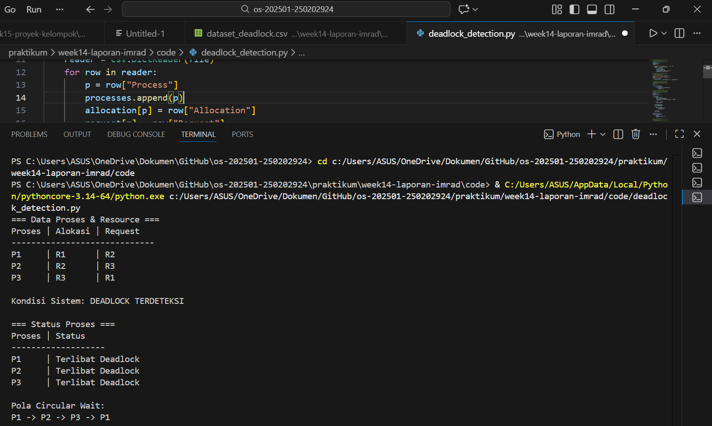

# Laporan Praktikum Minggu 14
Topik:  Penyusunan Laporan Praktikum Format IMRAD

---

## Identitas
- **Nama**  :  Putri Amaliya Rahmadani
- **NIM**   :  250202924
- **Kelas** : 1 IKRA

---

# Implementasi dan Analisis Algoritma Deteksi Deadlock pada Sistem Operasi

## 1. Pendahuluan

## 1.1 Latar Belakang

Deadlock merupakan kondisi dalam sistem operasi di mana dua atau lebih proses saling menunggu sumber daya yang sedang digunakan oleh proses lain, sehingga tidak ada proses yang dapat melanjutkan eksekusinya. Kondisi ini dapat menyebabkan sistem menjadi tidak responsif dan menurunkan kinerja apabila tidak ditangani dengan baik.

Menurut Silberschatz et al. (2018), deadlock dapat terjadi apabila empat kondisi terpenuhi secara bersamaan, yaitu mutual exclusion, hold and wait, no preemption, dan circular wait. Untuk mengetahui keberadaan deadlock dalam sistem, diperlukan suatu mekanisme deteksi deadlock yang mampu mengidentifikasi proses-proses yang terlibat berdasarkan hubungan alokasi dan permintaan sumber daya.

Oleh karena itu, praktikum ini dilakukan untuk mengimplementasikan algoritma deteksi deadlock serta menganalisis kondisi deadlock yang terjadi dalam sistem operasi melalui simulasi berbasis data alokasi dan permintaan sumber daya.

## 1.2 Rumusan Masalah

Berdasarkan latar belakang tersebut, rumusan masalah pada praktikum ini adalah:
1. Bagaimana cara mengimplementasikan algoritma deteksi deadlock dalam sistem operasi?
2. Bagaimana cara mengidentifikasi proses yang terlibat dalam kondisi deadlock berdasarkan data alokasi dan permintaan sumber daya?
3. Bagaimana hasil deteksi deadlock yang diperoleh dari simulasi yang dilakukan?

## 1.3 Tujuan Penelitian

Tujuan dari penelitian ini adalah:
1. Mengimplementasikan algoritma deteksi deadlock menggunakan data alokasi dan permintaan sumber daya.
2. Mengidentifikasi proses-proses yang berada dalam kondisi deadlock.
3. Menganalisis hasil deteksi deadlock berdasarkan teori sistem operasi.

---

# 2. Metode

## 2.1 Konfigurasi Lingkungan Praktikum

Praktikum ini dilaksanakan menggunakan perangkat keras dan perangkat lunak dengan spesifikasi sebagai berikut:
- Sistem Operasi: Windows
- Bahasa Pemrograman: Python
- Media Pengembangan: Visual Studio Code
- Metode Eksekusi: Program dijalankan melalui terminal/command prompt
Lingkungan ini digunakan untuk mengimplementasikan serta menguji algoritma deteksi deadlock berdasarkan data alokasi dan permintaan sumber daya antar proses.

## 2.2 Desain Pengujian 

Pengujian dilakukan dengan menggunakan data proses yang memiliki hubungan ketergantungan terhadap sumber daya. Setiap proses memiliki informasi mengenai sumber daya yang sedang dialokasikan (allocation) dan sumber daya yang masih diminta (request).

Algoritma deteksi deadlock dijalankan untuk menganalisis kemungkinan terbentuknya siklus (circular wait) antar proses. Jika siklus ditemukan, maka sistem dinyatakan berada dalam kondisi deadlock.

## Data Uji Parameter 

Data uji yang digunakan dalam praktikum ini meliputi:
- Daftar proses yang berjalan dalam sistem
- Resource yang dialokasikan kepada setiap proses
- Resource yang diminta oleh setiap proses
- Relasi ketergantungan antar proses
Dataset disimpan dalam format CSV untuk mempermudah proses pembacaan data oleh program.

## Prosedur Pengambilan Data 

Langkah-langkah pengambilan data dalam praktikum ini adalah sebagai berikut:
- Menyiapkan dataset yang berisi data proses, alokasi sumber daya, dan permintaan sumber daya.
- Mengimplementasikan algoritma deteksi deadlock ke dalam program Python.
- Menjalankan program menggunakan dataset yang telah disiapkan.
- Mengamati hasil analisis berupa status deadlock pada sistem.
Mencatat proses-proses yang teridentifikasi mengalami deadlock untuk dianalisis lebih lanjut.

# 3. Hasil

## 3.1 Hasil Eksekusi Program

Berdasarkan hasil eksekusi program deteksi deadlock, diperoleh informasi mengenai hubungan ketergantungan antar proses serta status deadlock pada sistem. Program mampu menampilkan proses-proses yang terlibat dalam siklus ketergantungan sumber daya.

## 3.2 Rekapitulasi Hasil Pengujian

| Proses |	Allocation |	Request |	Status |
|--------|-------------|----------|--------|
| P1 |	R1 |	R2 |	Deadlock |
| P2 |	R2 |	R3 |	Deadlock |
| P3 |	R3 | 	R1 |	Deadlock |

Tabel tersebut menunjukkan bahwa ketiga proses saling menunggu sumber daya satu sama lain sehingga membentuk kondisi deadlock.

## 3.3 Ringkasan Temuan

Berdasarkan hasil pengujian, diperoleh beberapa temuan utama sebagai berikut:
- Sistem mengalami kondisi deadlock akibat adanya siklus permintaan sumber daya.
- Proses-proses saling menunggu sumber daya yang sedang digunakan oleh proses lain.
- Algoritma deteksi deadlock berhasil mengidentifikasi proses yang terlibat dalam deadlock.

# 4. Pembahasan 

## 4.1 Analisis Hasil

Hasil praktikum menunjukkan bahwa kondisi deadlock terjadi ketika terdapat circular wait antar proses. Setiap proses memegang satu sumber daya dan menunggu sumber daya lain yang tidak dapat dilepaskan. Kondisi ini sesuai dengan karakteristik deadlock yang dijelaskan dalam teori sistem operasi.

Menurut Silberschatz, Galvin, dan Gagne (2018), deadlock dapat terjadi apabila keempat kondisi deadlock terpenuhi, yaitu mutual exclusion, hold and wait, no preemption, dan circular wait. Pada hasil pengujian, keempat kondisi tersebut terpenuhi sehingga sistem berada dalam keadaan deadlock.

## 4.2 Keterbatasan Praktikum

Praktikum ini memiliki beberapa keterbatasan, antara lain:
- Dataset yang digunakan masih bersifat sederhana.
- Jumlah proses dan sumber daya terbatas.
- Simulasi belum sepenuhnya merepresentasikan kondisi sistem operasi nyata.
Oleh karena itu, hasil praktikum ini belum dapat digeneralisasikan untuk semua sistem dengan kompleksitas yang lebih tinggi.

## 4.3 Kesesuaian dengan Teori

Sebelum praktikum dilakukan, diharapkan bahwa algoritma deteksi deadlock mampu mengidentifikasi kondisi deadlock berdasarkan hubungan ketergantungan antar proses. Hasil praktikum menunjukkan bahwa algoritma berhasil mendeteksi deadlock ketika terdapat siklus permintaan sumber daya.

Hal ini sesuai dengan teori yang dijelaskan oleh Tanenbaum dan Bos (2015) yang menyatakan bahwa deadlock dapat dideteksi dengan menganalisis resource allocation graph dan mencari adanya siklus di dalam graf tersebut. Dengan demikian, hasil eksperimen yang diperoleh sejalan dengan teori yang dipelajari dari buku referensi.

---
## Kesimpulan 

- Algoritma deteksi deadlock dapat digunakan untuk mengetahui adanya kondisi deadlock pada sistem operasi melalui analisis alokasi dan permintaan sumber daya.
- Hasil simulasi menunjukkan bahwa deadlock terjadi ketika proses saling menunggu sumber daya sehingga membentuk siklus ketergantungan.
- Implementasi yang dilakukan sudah sesuai dengan konsep deteksi deadlock yang dijelaskan dalam teori sistem operasi.
Keterbatasan pengujian terletak pada penggunaan dataset dan skenario yang masih sederhana.

---

## Hasil Eksekusi
Sertakan screenshot hasil percobaan atau diagram:

---

## Quiz
1. Mengapa format IMRAD membantu membuat laporan praktikum lebih ilmiah dan mudah dievaluasi?

   **Jawaban:** Format IMRAD memudahkan penyusunan laporan praktikum karena setiap bagian memiliki tujuan yang jelas, mulai     dari penjelasan masalah hingga analisis hasil. Silberschatz et al. (2018) menjelaskan bahwa struktur penulisan yang          sistematis membantu pembaca menilai metode dan hasil eksperimen secara lebih terarah, sedangkan Tanenbaum dan Bos (2015)     menekankan bahwa pemisahan hasil dan pembahasan meningkatkan kejelasan evaluasi ilmiah.

2. Apa perbedaan antara bagian Hasil dan Pembahasan?

   **Jawaban:** Bagian Hasil berisi penyajian data atau output yang diperoleh dari praktikum, seperti tabel, grafik, atau       hasil eksekusi program, tanpa disertai penafsiran. Bagian ini fokus pada apa yang diperoleh dari eksperimen.
   Sementara itu, bagian Pembahasan berisi penjelasan dan interpretasi terhadap hasil tersebut, termasuk alasan terjadinya      hasil, kaitannya dengan teori, serta perbandingan dengan ekspektasi atau referensi yang digunakan. Pembahasan menjelaskan    mengapa hasil tersebut terjadi, bukan sekadar apa hasilnya.

3. Mengapa sitasi dan daftar pustaka penting, bahkan untuk laporan praktikum?

   **Jawaban:** Sitasi dan daftar pustaka penting dalam laporan praktikum karena menunjukkan bahwa penulisan didasarkan pada    sumber yang jelas dan dapat dipertanggungjawabkan. Dengan mencantumkan referensi, penulis menghargai karya ilmiah orang      lain dan menghindari plagiarisme. Selain itu, sitasi membantu pembaca menelusuri teori atau konsep yang digunakan            sehingga laporan praktikum memiliki dasar ilmiah yang kuat dan mudah diverifikasi.
---

## Referensi

1. Silberschatz, A., Galvin, P. B., & Gagne, G. (2018). *Operating System Concepts* (10th ed.). Wiley.
2. Tanenbaum, A. S., & Bos, H. (2015). *Modern Operating Systems* (4th ed.). Pearson.

---
## Refleksi Diri
Tuliskan secara singkat:
- Apa bagian yang paling menantang minggu ini? mengimplementasikan algoritma deteksi deadlock
- Bagaimana cara Anda mengatasinya?  mempelajari kembali konsep deadlock dari materi kuliah dan referensi buku

---

**Credit:**  
_Template laporan praktikum Sistem Operasi (SO-202501) – Universitas Putra Bangsa_
